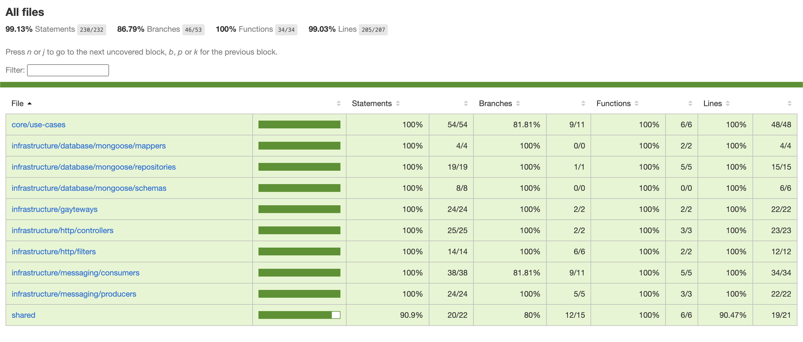

# 🍳 Production Service (Cozinha)

Microsserviço responsável pelo gerenciamento da fila de pedidos da cozinha. Recebe notificações de pagamento, consulta os itens do pedido e gerencia o status de preparação (Recebido -> Em Preparo -> Pronto -> Entregue).

### Testes
